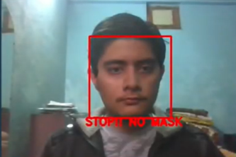

## Face-Mask Detector
Real time face-mask detecion using CNNs and Deep Learning. 
This model can predict multiple faces at the same time and supports all types of web cameras. 
The accuracy we acheived was around 96.8% on our training dataset and there was no time-lag between the video and output. 

# About
This project uses deep learning and convolutional neural networks with the help of libraries like Keras, Tensorflow, OpenCV. 

